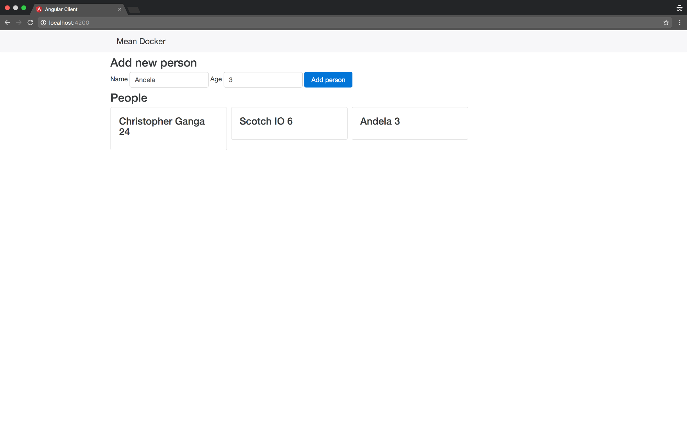

# Angular Employee Directory
This is a MEAN app built with Angular and Docker Compose. I separately built out three parts of the app:

1. Angular
2. Express/Node API
3. MongoDB

The approach that I took was to built the app in our local environment, then dockerizing the app.

**NOTE**: I only built two containers, Angular and the Express/Node API. The third container can from a MongoDB image that I pulled from the [Docker Hub](https://hub.docker.com/explore/)

This application is to allow a business/company to record they employees.

This is how the application looks:

